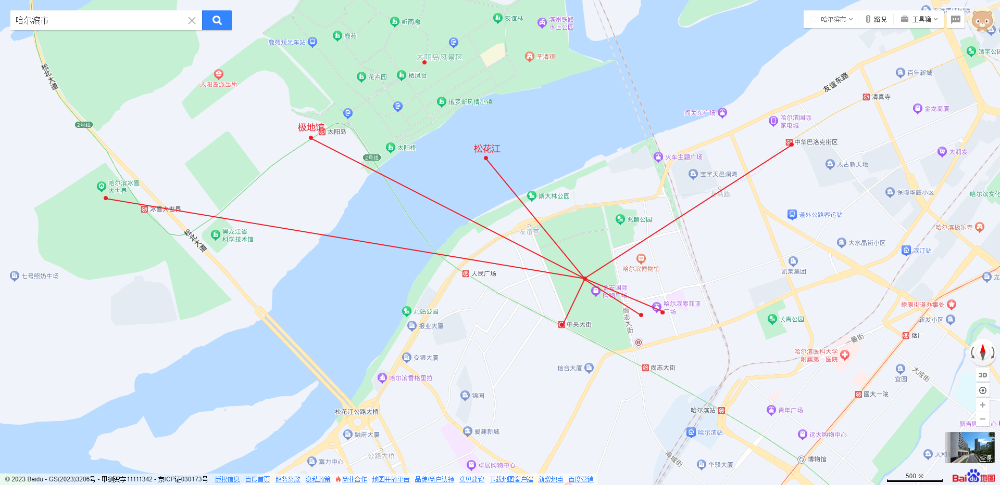

# Travel Map Planner

一个以地图为核心的旅行路线规划工具。可以在浏览器里创建多天旅行方案，搜索地点，安排路线点、住宿点和餐饮点，查看路线，并把方案保存到本地或导出为 JSON 备份。



## 快速使用

### 1. 安装依赖

```bash
npm install
```

### 2. 启动项目

```bash
npm run dev
```

然后打开终端里显示的访问地址，通常是：

```text
http://127.0.0.1:5173/
```

### 3. 在网页里填写百度地图 API

打开页面后，点击右上角的“地图 API 设置”，把百度地图浏览器端 AK 填进去并保存即可。

还没有 AK 的话，可以从这里申请：

- [百度地图开放平台](https://lbsyun.baidu.com/)
- [百度地图开放平台控制台](https://lbsyun.baidu.com/apiconsole/key#/home)

申请时创建“浏览器端”应用，启用 JavaScript API，并配置 Referer 白名单，例如：

```text
http://127.0.0.1:5173/*
```

如果想把 AK 固定在本地环境变量里，也可以复制 `.env.example` 为 `.env`，然后填写：

```env
VITE_BAIDU_BROWSER_AK=你的百度地图浏览器端AK
```

## 基本操作

1. 在控制台新建或打开旅行方案。
2. 搜索地点，把地点加入当天路线、住宿或餐饮。
3. 在左侧切换日期、调整点位顺序。
4. 点击地图上的点位或路线查看详情。
5. 点击“保存方案”保存到浏览器本地。
6. 点击导出备份 JSON，之后可以再导入继续编辑。

## 其他地图源

当前主要测试路径是百度地图。Mock 地图源和高德代理仍保留在项目里，但尚未完全测试。

## 常用命令

启动开发环境：

```bash
npm run dev
```

运行测试：

```bash
npm test
```

运行 lint：

```bash
npm run lint
```

构建生产版本：

```bash
npm run build
```

## 本地数据和备份

项目默认使用浏览器 `localStorage` 保存方案，不需要账号，也不需要后端数据库。

重要方案建议同时导出 JSON 备份。导出的 JSON 是完整可编辑数据，不是截图，之后可以通过控制台导入继续调整路线和点位。

## 技术栈

- React 19
- TypeScript
- Vite
- Vitest
- Testing Library
- Lucide React

## License

MIT
